# Database Architecture

This document provides a visual representation of the PostgreSQL database schema for the GP Consultation Data Extraction System.

## Entity Relationship Diagram

The following Mermaid diagram shows all 16 MVP tables with their relationships and cardinality.

```mermaid
erDiagram
    CONSULTATION_SESSIONS ||--o{ CONSULTATIONS : "has"
    CONSULTATION_SESSIONS ||--o{ SYMPTOMS : "contains"
    CONSULTATION_SESSIONS ||--o{ MEDICATIONS : "contains"
    CONSULTATION_SESSIONS ||--o{ ASSOCIATED_FINDINGS : "contains"
    CONSULTATION_SESSIONS ||--o{ PHYSICAL_EXAMINATION_FINDINGS : "contains"
    CONSULTATION_SESSIONS ||--o{ REVIEW_OF_SYSTEMS : "contains"
    CONSULTATION_SESSIONS ||--o{ VITAL_SIGNS : "contains"
    CONSULTATION_SESSIONS ||--o{ LABORATORY_RESULTS : "contains"
    CONSULTATION_SESSIONS ||--o{ CLINICAL_ASSESSMENT_EXTRACTED : "contains"
    CONSULTATION_SESSIONS ||--o{ RED_FLAGS_AND_WARNINGS : "contains"
    CONSULTATION_SESSIONS ||--o{ FOLLOW_UP_PLAN_EXTRACTED : "contains"
    CONSULTATION_SESSIONS ||--o{ ALLERGIES : "contains"
    CONSULTATION_SESSIONS ||--o{ DIAGNOSES : "contains"
    
    SEVERITY_LEVELS ||--o{ SYMPTOMS : "defines"
    SEVERITY_LEVELS ||--o{ PHYSICAL_EXAMINATION_FINDINGS : "defines"
    SEVERITY_LEVELS ||--o{ RED_FLAGS_AND_WARNINGS : "defines"
    
    DIAGNOSTIC_CERTAINTY ||--o{ DIAGNOSES : "defines"
    DIAGNOSTIC_CERTAINTY ||--o{ CLINICAL_ASSESSMENT_EXTRACTED : "defines"

    CONSULTATION_SESSIONS {
        uuid consultation_session_id PK
        uuid patient_id FK
        uuid doctor_id FK
        timestamp session_start_datetime
        text full_transcript
        string transcript_language
        boolean nlp_processed_flag
        timestamp created_at
    }

    CONSULTATIONS {
        uuid consultation_id PK
        uuid consultation_session_id FK
        uuid patient_id FK
        uuid doctor_id FK
        timestamp consultation_datetime
        string consultation_type
        text chief_complaint
        text history_of_present_illness
        timestamp created_at
    }

    SYMPTOMS {
        uuid symptom_id PK
        uuid consultation_session_id FK
        uuid patient_id FK
        string symptom_name
        string symptom_code
        string severity FK
        int duration_days
        timestamp onset_date
        string temporal_pattern
        float confidence_score
        jsonb clinical_modifiers
        timestamp extracted_at
    }

    MEDICATIONS {
        uuid prescription_id PK
        uuid consultation_session_id FK
        uuid patient_id FK
        uuid doctor_id FK
        string medication_name
        int dosage_value
        string dosage_unit
        string frequency
        int duration_value
        string duration_unit
        string route_of_administration
        string indication
        timestamp prescribed_at
    }

    ASSOCIATED_FINDINGS {
        uuid finding_id PK
        uuid consultation_session_id FK
        uuid patient_id FK
        string finding_type
        text finding_description
        string severity FK
        timestamp recorded_at
    }

    PHYSICAL_EXAMINATION_FINDINGS {
        uuid exam_finding_id PK
        uuid consultation_session_id FK
        uuid patient_id FK
        string examination_type
        string anatomical_site
        text findings
        string severity FK
        timestamp examined_at
    }

    REVIEW_OF_SYSTEMS {
        uuid ros_id PK
        uuid consultation_session_id FK
        uuid patient_id FK
        string system_name
        text findings
        timestamp reviewed_at
    }

    VITAL_SIGNS {
        uuid vital_sign_id PK
        uuid consultation_session_id FK
        uuid patient_id FK
        float temperature
        string blood_pressure
        int heart_rate
        float oxygen_saturation
        int respiratory_rate
        timestamp measured_at
    }

    LABORATORY_RESULTS {
        uuid lab_result_id PK
        uuid consultation_session_id FK
        uuid patient_id FK
        string test_name
        string test_code
        string result_value
        string reference_range
        string unit
        timestamp test_date
    }

    CLINICAL_ASSESSMENT_EXTRACTED {
        uuid assessment_id PK
        uuid consultation_session_id FK
        uuid patient_id FK
        uuid doctor_id FK
        text assessment_diagnosis
        string diagnostic_certainty FK
        text diagnostic_reasoning
        text key_clinical_features_supporting
        timestamp assessed_at
    }

    RED_FLAGS_AND_WARNINGS {
        uuid red_flag_id PK
        uuid consultation_session_id FK
        uuid patient_id FK
        text warning_description
        string warning_type
        string severity FK
        timestamp identified_at
    }

    FOLLOW_UP_PLAN_EXTRACTED {
        uuid follow_up_id PK
        uuid consultation_session_id FK
        uuid patient_id FK
        string follow_up_type
        string timing
        text condition
        text action
        string priority
        timestamp planned_at
    }

    ALLERGIES {
        uuid allergy_id PK
        uuid consultation_session_id FK
        uuid patient_id FK
        string allergen
        string reaction
        string severity FK
        timestamp recorded_at
    }

    DIAGNOSES {
        uuid diagnosis_id PK
        uuid consultation_session_id FK
        uuid patient_id FK
        uuid doctor_id FK
        string diagnosis_name
        string diagnosis_code
        string diagnostic_certainty FK
        text clinical_notes
        timestamp diagnosed_at
    }

    SEVERITY_LEVELS {
        string severity_level PK
        string description
    }

    DIAGNOSTIC_CERTAINTY {
        string certainty_level PK
        string description
    }
```



## Table Descriptions

### Core Tables

#### CONSULTATION_SESSIONS
Primary table containing session metadata and full transcript.
- **Primary Key**: `consultation_session_id`
- **Foreign Keys**: `patient_id`, `doctor_id`
- **Purpose**: Store complete consultation session with NLP processing flag

#### CONSULTATIONS
Structured consultation record with chief complaint and history.
- **Primary Key**: `consultation_id`
- **Foreign Keys**: `consultation_session_id`, `patient_id`, `doctor_id`
- **Purpose**: Store structured consultation data

### Clinical Entity Tables

#### SYMPTOMS
Patient-reported symptoms with severity and temporal information.
- **Primary Key**: `symptom_id`
- **Foreign Keys**: `consultation_session_id`, `patient_id`, `severity`
- **Purpose**: Track symptoms mentioned during consultation

#### MEDICATIONS
Prescribed medications with dosage and administration details.
- **Primary Key**: `prescription_id`
- **Foreign Keys**: `consultation_session_id`, `patient_id`, `doctor_id`
- **Purpose**: Record medication prescriptions

#### DIAGNOSES
Final diagnoses with certainty levels.
- **Primary Key**: `diagnosis_id`
- **Foreign Keys**: `consultation_session_id`, `patient_id`, `doctor_id`, `diagnostic_certainty`
- **Purpose**: Store diagnostic conclusions

### Examination Tables

#### VITAL_SIGNS
Clinical measurements (temperature, BP, heart rate, etc.).
- **Primary Key**: `vital_sign_id`
- **Foreign Keys**: `consultation_session_id`, `patient_id`
- **Purpose**: Record vital sign measurements

#### PHYSICAL_EXAMINATION_FINDINGS
Physical examination results by anatomical site.
- **Primary Key**: `exam_finding_id`
- **Foreign Keys**: `consultation_session_id`, `patient_id`, `severity`
- **Purpose**: Document physical exam findings

### Assessment Tables

#### CLINICAL_ASSESSMENT_EXTRACTED
Diagnostic assessment with reasoning.
- **Primary Key**: `assessment_id`
- **Foreign Keys**: `consultation_session_id`, `patient_id`, `doctor_id`, `diagnostic_certainty`
- **Purpose**: Capture clinical reasoning and assessment

#### RED_FLAGS_AND_WARNINGS
Warning signs requiring attention.
- **Primary Key**: `red_flag_id`
- **Foreign Keys**: `consultation_session_id`, `patient_id`, `severity`
- **Purpose**: Flag concerning symptoms or findings

#### FOLLOW_UP_PLAN_EXTRACTED
Follow-up instructions and timing.
- **Primary Key**: `follow_up_id`
- **Foreign Keys**: `consultation_session_id`, `patient_id`
- **Purpose**: Track follow-up plans

### Lookup Tables

#### SEVERITY_LEVELS
Valid severity values: `mild`, `moderate`, `severe`, `critical`

#### DIAGNOSTIC_CERTAINTY
Valid certainty levels: `confirmed`, `probable`, `suspected`, `ruled_out`

## Relationships

### One-to-Many Relationships
- One `CONSULTATION_SESSION` has many `SYMPTOMS`
- One `CONSULTATION_SESSION` has many `MEDICATIONS`
- One `CONSULTATION_SESSION` has many `DIAGNOSES`
- One `SEVERITY_LEVEL` defines many `SYMPTOMS`
- One `DIAGNOSTIC_CERTAINTY` defines many `DIAGNOSES`

### Foreign Key Constraints
All foreign keys maintain referential integrity:
- `consultation_session_id` links all entities to their session
- `patient_id` links entities to patients
- `doctor_id` links prescriptions and assessments to doctors
- `severity` links to `SEVERITY_LEVELS` lookup table
- `diagnostic_certainty` links to `DIAGNOSTIC_CERTAINTY` lookup table

## Data Flow

1. **Extraction**: LangExtract processes transcript
2. **Mapping**: Entities mapped to table structures
3. **UUID Generation**: Primary keys generated with `uuid4()`
4. **Relationship Linking**: Foreign keys maintain relationships
5. **CSV Export**: One file per table
6. **Database Ingestion**: CSVs loaded into PostgreSQL

## Database Ingestion Guide

### CSV Import Order

Import tables in this order to satisfy foreign key constraints:

1. `severity_levels.csv` (lookup table)
2. `diagnostic_certainty.csv` (lookup table)
3. `consultation_sessions.csv` (parent table)
4. All other tables (child tables)

### PostgreSQL COPY Command

```sql
COPY consultation_sessions FROM '/path/to/consultation_sessions.csv' 
WITH (FORMAT csv, HEADER true, ENCODING 'UTF-8');

COPY symptoms FROM '/path/to/symptoms.csv' 
WITH (FORMAT csv, HEADER true, ENCODING 'UTF-8');
```

### Handling JSONB Fields

JSONB fields are exported as JSON strings and can be imported directly:
```sql
-- clinical_modifiers column in SYMPTOMS table
-- Exported as: "{\"key\": \"value\"}"
-- PostgreSQL automatically converts to JSONB
```

## Schema Validation

The system ensures:
- All UUIDs are valid UUID4 format
- All timestamps are in ISO 8601 format
- All foreign keys reference existing records
- All severity values exist in `SEVERITY_LEVELS`
- All certainty values exist in `DIAGNOSTIC_CERTAINTY`
